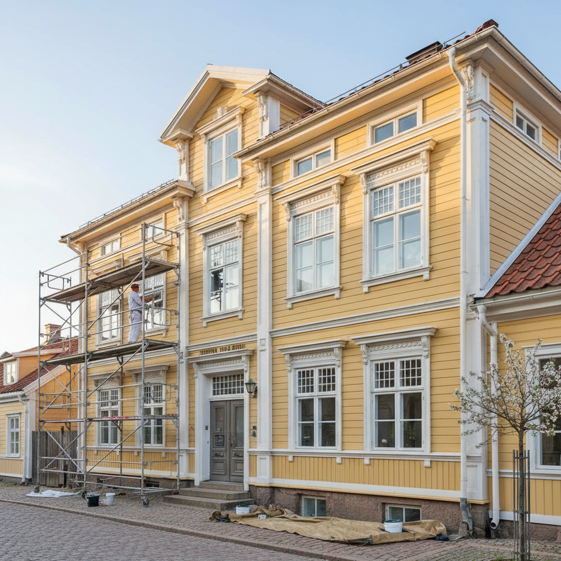
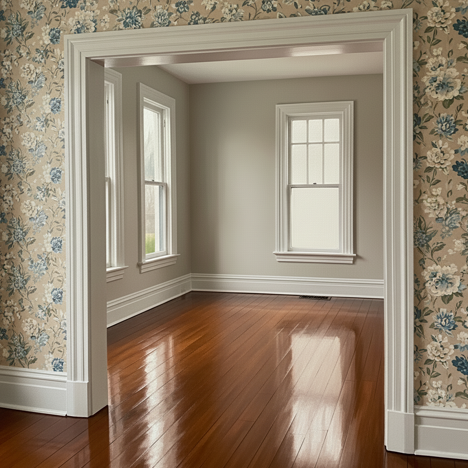
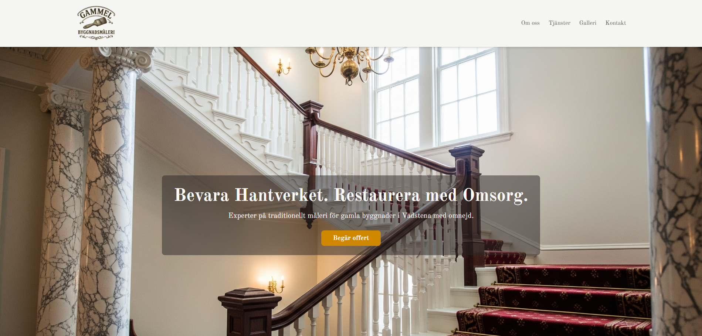
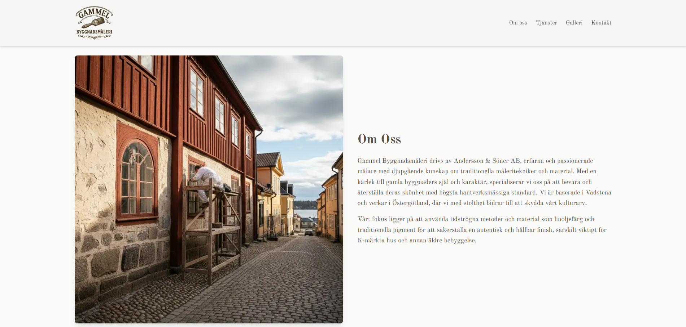
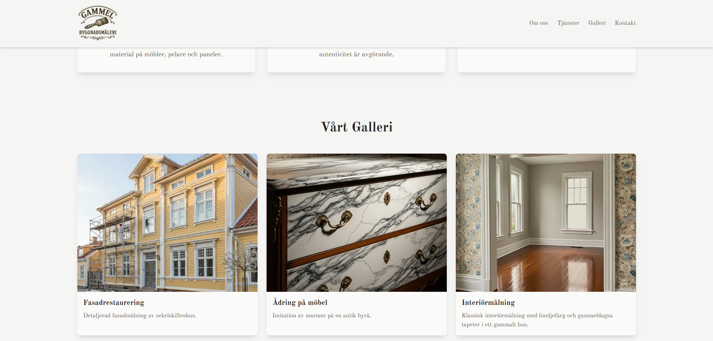
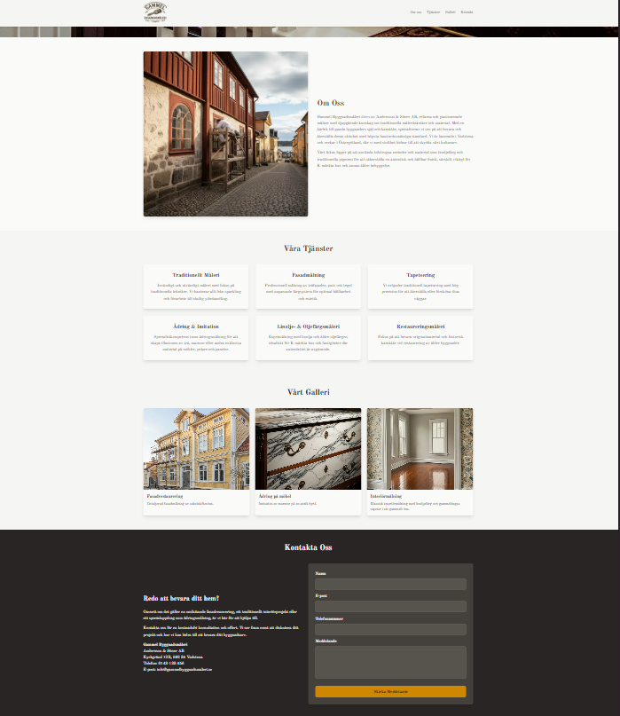
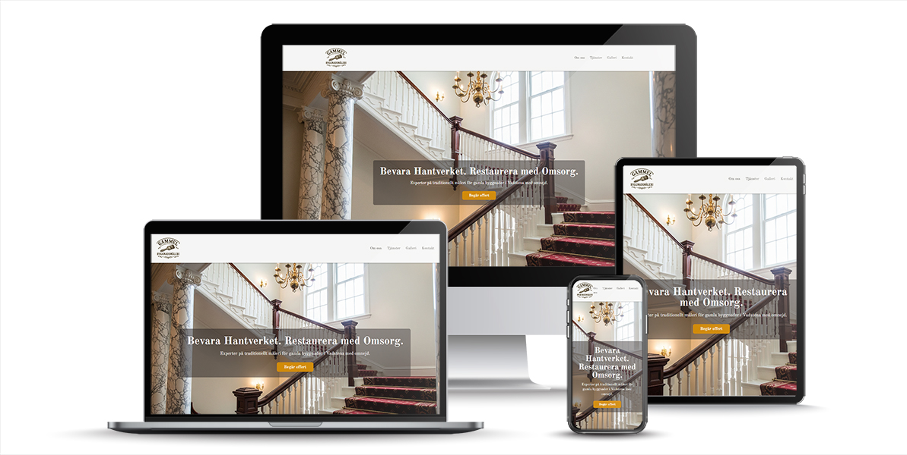

**Namn:** Gammel Byggnadsmåleri Ericson & Söner AB
**Plats:** Vadstena, Östergötland
**Webbplats:** [Gammel Byggnadsmåleri](https://gammelbyggnadsmaleri.vercel.app/)) 

---

## Om Projektet

Som frilansare hos **Kod & Design** är detta projekt ett exempel på hur jag skapar digitala lösningar som fångar essensen av mina kunders verksamhet. För Gammel Byggnadsmåleri har jag strävat efter att balansera det **traditionella och tidlösa** med ett **modernt och funktionellt** uttryck. Webbplatsen är byggd med Next.js för att erbjuda en robust och skalbar plattform.

---

## Projektbilder

Här är några bilder som visar upp webbplatsens design och Gammel Byggnadsmåleri's arbete:


*Detaljerad fasadmålning av sekelskifteshus.*


*Imitation av marmor på en antik byrå.*


*Klassisk interiörmålning med linoljefärg.*


*Fokus på att bevara originalmaterial och historisk karaktär.*










*En överblick av webbplatsens design.*

---

## Filstruktur

.
├── public
│   ├── images
│   │   ├── fasadrestaurering.png
│   │   ├── interiormålning.png
│   │   ├── loggagammelbyggnad.png
│   │   ├── marmorimmitation.png
│   │   ├── restaurera.png
│   │   └── traditionelltmaleri.png
│   ├── image1.png
│   ├── image2.png
│   ├── image3.png
│   ├── image4.png
│   └── mockup-gammelbyggnadsmaleri.jpg
├── src
│   ├── app
│   │   ├── api
│   │   │   └── contact
│   │   │       └── route.ts
│   │   ├── favicon.ico
│   │   ├── globals.css
│   │   ├── layout.tsx
│   │   └── page.tsx
│   └── components
│       ├── AboutUsSection.tsx
│       ├── ContactForm.tsx
│       ├── ContactSection.tsx
│       ├── Footer.tsx
│       ├── GallerySection.tsx
│       ├── Header.tsx
│       ├── HeroSection.tsx
│       └── ServicesSection.tsx
├── .env.local
├── .gitignore
├── eslint.config.mjs
├── next-env.d.ts
├── next.config.ts
├── package-lock.json
├── package.json
├── postcss.config.mjs
├── README.md
└── tsconfig.json


---

## Nyckelkomponenter

* **Header:** Inkluderar företagets logotyp och navigationslänkar till olika sektioner på sidan.
* **HeroSection:** En iögonfallande sektion med en bakgrundsbild som sätter tonen och en tydlig uppmaning till handling.
* **AboutUsSection:** Ger information om Gammel Byggnadsmåleri, deras expertis inom traditionellt måleri och deras koppling till Vadstena.
* **ServicesSection:** Beskriver de olika tjänster som erbjuds, med fokus på traditionella tekniker och material.
* **GallerySection:** Visar upp tidigare projekt med bilder och korta beskrivningar för att illustrera företagets hantverksskicklighet.
* **ContactSection:** Innehåller kontaktinformation och ett formulär för potentiella kunder att enkelt nå företaget.
* **Footer:** Innehåller copyrightinformation och en omnämning av utvecklaren.

---

## Teknologier som används

* **Next.js:** Ett React-ramverk för server-side rendering och statisk webbplatsgenerering.
* **React:** Ett JavaScript-bibliotek för att bygga användargränssnitt.
* **Tailwind CSS:** Ett utility-first CSS-ramverk för snabb och konsekvent styling.
* **TypeScript:** Ett typsäkert superset av JavaScript som ger bättre kodkvalitet och utvecklarupplevelse.

---

## Utvecklare

Denna webbplats är skapad av **Josefine Eriksson** som driver **Kod & Design** ([kodochdesign.se](https://kodochdesign.se)).

---

## Installation och Lokal Körning

För att köra projektet lokalt, följ dessa steg:

1.  **Klona repositoryt:**
    ```bash
    git clone [https://ejahoglund.se/blogg/bare-git-repository/](https://ejahoglund.se/blogg/bare-git-repository/)
    cd gammelbyggnadsmaleri-webbplats
    ```
2.  **Installera beroenden:**
    ```bash
    npm install
    # eller
    yarn install
    ```
3.  **Skapa en `.env.local`-fil** i roten av projektet om du inte redan har en, och lägg till nödvändiga miljövariabler (t.ex. för e-posttjänster om du har en sådan integrerad).
4.  **Starta utvecklingsservern:**
    ```bash
    npm run dev
    # eller
    yarn dev
    ```
5.  Öppna din webbläsare och gå till `http://localhost:3000`.

---

